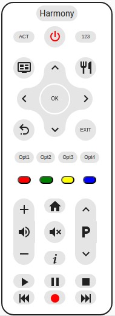
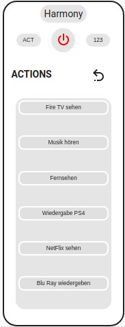
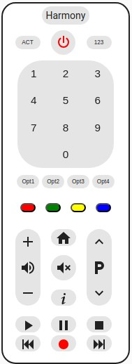

# My-Harmony-Card
Not another Remote Control for Logitech HARMONY COMPANION 

[](https://github.com/hacs/integration)
[](https://buymeacoffee.com/dezi)

This project is inspired by the LG WebOS Remote Card based on (madmicio's [repository](https://github.com/madmicio/LG-WebOS-Remote-Control))





# Introduction
All the remote controls for the Harmony that I found didn't appeal to me either visually or functionally. Luckily I stumbled upon madmicio's project. I really liked the layout. 
I decided to develop a solution for Harmony based on this. Unfortunately, the current implementation of the aioharmony library, used by Home Assistant core, doesn't handle actions very well (or I didn't find it, in which case I ask for hints). This means that it is possible to switch device groups on and off using actions and to determine which action is currently active, but unfortunately that is nearly all that is possible, using actions.

For this reason, the functions of the Harmony's buttons cannot be mapped 1:1 to the functions of the physical remote control.
I therefore took the route of using actions to control the device groups and, at the moment when an action is active, addressing the device directly with its ID and aligning the buttons on the remote control as flexibly as possible.

## HACS Card install
### 1. Access HACS

- Open your Home Assistant interface.
- Navigate to the sidebar and click on **HACS**.

### 2. Open Frontend Section

- In HACS, go to the **Frontend** tab.

### 3. Add a Custom Repository

- Click on the three dots (menu) in the upper right corner of the HACS Frontend page.
- Select **Custom repositories** from the dropdown menu.

### 4. Add My Harmony Card Repository

- In the dialog that appears, you will see a text field labeled **"Repository"**.
- Paste the following URL into this field: `https://github.com/dezihh/my-harmony-card`.
- Set the **Category** to `Lovelace` from the dropdown menu.
- Press the **Add** button.

### 5. Install My Harmony Card

- After adding the repository, close the custom repositories dialog.
- Return to the HACS Frontend page, and you should now see **My-Harmony-Card** listed.
- Click on **My-Harmony-Card**.
- Press the **Download** button to install it.

### 6. Configure Lovelace

- Once the card is installed, you need to add it to your Lovelace dashboard.
- Go to your Lovelace dashboard.
- Click on the three dots (menu) in the upper right corner of the dashboard and select **Edit Dashboard**.
- Click on **Add Card**.
- Search for **My-Harmony-Card** and select it.
- Configure the card settings as per your requirements and save it.

### Post-Installation

- After installing and configuring My-Harmony-Card, you may need to refresh your Home Assistant page or restart Home Assistant to ensure the card loads correctly.
- Refer to the documentation provided in the repository for any additional configuration options or troubleshooting tips.

By following these steps, you should have My-Harmony-Card successfully installed and running in your Home Assistant setup.


## Manual install
To manually install My-Harmony-Card in Home Assistant, please follow these detailed steps:

### 1. Navigate to Your Home Assistant Root Directory
- Open a terminal window.
- Navigate to the root directory of your Home Assistant installation. This is the directory where you find `configuration.yaml`.

```sh
cd /path/to/your/homeassistant/
```
- Change to the www/community/ directory
- Create a new directory for My Harmony Card
```cd www/community/
mkdir my-harmony-card
cd my-harmony-card
```
- Download most actual version and verify Download
- _Please note, you have to look to the releases to find the latest version id. Please enter the most recent version_
```
wget https://github.com/dezihh/my-harmony-card/releases/download/1.0.2/my-harmony-card.js
ls -l my-harmony-card.js
```
###  2. Add the Resource in Home Assistant
- Open your Home Assistant interface.
- Go to a dashboard in the frontend and switch to edit mode by clicking the pencil icon in the upper right corner.
- Click on the three dots (menu) in the upper right corner.
- Select Resources or Manage Resources (the exact wording might vary).

### 3. Add the JavaScript Module
- Click on the blue Add Resource button.
- In the URL field, enter:
```
/hacsfiles/my-harmony-card/my-harmony-card.js?hacstag=1718527325
```
- Set the Resource Type to JavaScript Module using the radio button.
- Click Save.

### 4. Refresh your broser
- Reload your browser window by pressing Shift + F5 to ensure the new resource is loaded.

### Post-Installation
- After completing these steps, My Harmony Card should be available for use in your Lovelace dashboard.
By following these steps, you should have My-Harmony-Card successfully installed and running in your Home Assistant setup
I recomand HACS setup, because of aupdatemangement

# lovelace config: default view
At least the following entries must be present for the card to work:
```yaml
- type: 'custom:my-harmony-card'
  entity: remote.<device>
  activities:
    PowerOff:
      device_id: -1 
```

### Main Options
| Name | Type | Default | Example | Description |
| -------------- | ----------- | ------------ | ------------------------------------------------ | --------------------------------------------------------------------------------------------------------------------------------------------------------------------------------------------------------------------------------------------------------------------------------------------------------------------------------------------- |
| `type` | string | **Required** | `custom:my-harmony-card` | Type of the card |
| `entity` | string | **Required** | remote.<device> | harmony entity |
| `name` | string | **Option** | Living | name of harmony device in HA, ie. living room |
| `tooltip` | bool | **Option** | false | Displays tooltip on hoover on buttons Guide, Menu, Home, Info, Keypad, and 'ACT' (Actions). |

### Actions
You allways need PowerOff as defined action. To configure the rest of the actions correctly, the file harmony_????.conf, which is located in the root directory of the Home Assistant
installation directory is required for reference. Please note the above ???? is a number. 

Next, open the file. At the top you will find the “Activities” section. Here is the heading of each activity that is defined in unison (e.g. Watch TV). The number before the activity on the same line is added as “Name:” under the activity (e.g. 36824865). Repeat this process for all other activities listed
#### Example harmony????.conf
```json
{    "Activities": {
        "-1": "PowerOff",
        "36824865": "Watch Tv",
        "36829890": "Play Blue Ray",
        "36830123": "Listen Music",
        "37038020": "Play PS5"
    },
```
#### Example actions
Here a very basic example:
```yaml
~~~
type: 'custom:my-harmony-card'
entity: remote.harmony_wohnzimmer
activities:
  Listen to Music:
    name: 36830123
    device_id: 59107742
  Watch TV:
    name: 36824865
    device_id: 59107742
  PowerOff:
    device_id: -1
~~~~
```
#### The device_id:
The device_id: is one of the most important parameters. It defines which device is addressed when a command is sent. The number of the device that is <b>primarily addressed</b> by remote control should be entered as device_id:. <br>
The device_id: of each device can also be found in the harmony???.conf at the end of the respective device definition and begins with "id": . Please only accept the respective number. 
Example: device_id: 77085993
```json
   ~~~more functions~~~
     "Delete",
     "Apps",
     "Home"
   ],
   "id": "77085993"
 },
 ~~~next device~~~
```

### Activities Options
As explained above, due to the restrictions we can only control individual devices and not any actions (except channel changes). To alleviate this problem, selected keys can be overridden with functions that better suit the device and the particular key inside of an action.

| Name | Type | Default | Example | Description |
| -------------- | ----------- | ------------ | ------------------------------------------------ | --------------------------------------------------------------------------------------------------------------------------------------------------------------------------------------------------------------------------------------------------------------------------------------------------------------------------------------------- |
| `device_id` | number| **Required** | 77085993 | This is the device id below each defined individual activity |
| `volume_device_id`| number| **Optional** | 59107742 | Special: If you define this, you can send VolumeUp and VolumeDown to a different device. I.e. If you have an AV Receiver and you watch TV, you want to send all commands to TV, but volume change has to be send to AV Receier. In this case, enter the device_id of AV Receiver here |
| `Guide`| string| **Optional** | InputCD | Below each activity you can define this option. In this example "InputCD" will be send to default device_id instead of 'Guide'. Remove the option for default. |
| `Home`| string| **Optional** | InputGame | See comments to 'Guide'. Command to send instead of 'Home' |
| `Info`| string| **Optional** | Favorite| See comments to 'Guide'. Command to send instead of 'Info' |
| `OK`| string| **Optional** | Enter| See comments to 'Guide'. Command to send instead of 'OK' |
| `player_name` | media_player entitiy| **Optional** | media_player.anlage | You can add a media_player entitiy for each activity. If you press log the 'Menu' button, it opens 'more-info  of the defined media_player|


### Button Options
Below each activity you can have up to 4 individual buttons. You can name it as you like (3 Chars) and you can add an idividual command for each of these button (Button[1-4]).
If you don't do, the buttons are invisible.
| Name | Type | Default | Example | Description |
| -------------- | ----------- | ------------ | ------------------------------------------------ | --------------------------------------------------------------------------------------------------------------------------------------------------------------------------------------------------------------------------------------------------------------------------------------------------------------------------------------------- |
| `Button[1-4]` | text | **Required** | Button1| Only Button1, Button2, Button3, Button4 are possible|
| `name`| 3 Char| **Required** | DVR| Name on button |
| `command`| string| **Required** | DVR| Command to send to device_id of activity |
| `tooltip`| string| **Optional** | Digital Video Recorder| Tooltip information to button (long text) |

### Complete Example
```yaml
type: custom:my-harmony-card
name: Harmony
entity: remote.harmony_wohnzimmer
tooltip: true
activities:
  Musik hören:
    name: 36830123
    device_id: 59107742
    player_name: media_player.anlage
    Button1:
      name: MCh
      command: ModeMultiChStereo
      tooltip: Multichannel Stereo
    Button2:
      name: QS1
      command: QuickSelect1
      tooltip: AV Receiver Macro 1
    Button3:
      name: CD
      command: InputCd
      tooltip: Input CD Player
    Button4:
      name: Eco
      command: Eco
      tooltip: Eco Mode
  NetFlix sehen:
    name: 37038020
    device_id: 43935598
    volume_device_id: 59107742
    player_name: media_player.lg_webos_smart_tv
    Button1:
      name: Set
      command: Settings
      tooltip: Settings
    Button2:
      name: Smt
      command: SmartMenu
      tooltip: SmartMenu
    Button3: null
    Button4: null
dimensions:
  scale: '0.59'
  border_width: 2px
````

## More Functions
The buttons Forward and rewind have two functions:
- Short pressed: FastForward or Rewind
- Long pressed: SkipForward or SkipBack

## Troubleshooting
After installing card, adding default configuration and harmony entity, you should see immediate your configurated activities, if you press the "ACT" Button.<br>
In PowerOff mode, the power button should be "red", otherwise "green". <br>
If you have configured your activities as described above, you should be able to do the first actions (ie. VolumeUp, Guide, Home, Number, etc.) <br>
If this isn't working, you should not go on, because there is a naming missmatch between your configured activities and the real activities. This could be happen, due nameing special characters (ie. +, -, " ", Ü, ^, etc.). <br>
In this case I recomand either
- Rename your activity at the harmony device to a "better" name, best without whitespaces
- Copy name of activity from Development Tools --> Conditions --> <Harmony Device> --> Attributes <br>

**Relevant for mapping activity is the name (ie. NetFlix sehen: in the example above), _not_ the named number!**
  
