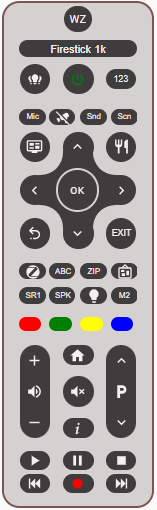

# My-Harmony-Card

Not another Remote Control for Logitech HARMONY COMPANION

[](https://github.com/hacs/integration)  
[](https://buymeacoffee.com/dezi)

This project is inspired by the LG WebOS Remote Card based on (madmicio's [repository](https://github.com/madmicio/LG-WebOS-Remote-Control))

     

## Introduction

All the remote controls for the Harmony that I found didn't appeal to me either visually or functionally. Luckily I stumbled upon madmicio's project. I really liked the layout.  
I decided to develop a solution for Harmony based on this. Unfortunately, the current implementation of the aioharmony library, used by Home Assistant core, doesn't handle actions very well (or I didn't find it, in which case I ask for hints). This means that it is possible to switch device groups on and off using actions and to determine which action is currently active, but unfortunately that is nearly all that is possible, using actions.

For this reason, the functions of the Harmony's buttons cannot be mapped 1:1 to the functions of the physical remote control.  
I therefore took the route of using actions to control the device groups and, at the moment when an action is active, addressing the device directly with its ID and aligning the buttons on the remote control as flexibly as possible.

## Card install

You should find this card by searching "My-Harmony-Card" the HACS Community Store.  
If this should not work or for any other reasons, you can find a more manual install Howto [here](https://github.com/dezihh/my-harmony-card/blob/master/Install.md).

If the card is installed, we can go on with configuring...

## Card config:

At least the following entries must be present for the card to work:

```
- type: 'custom:my-harmony-card'
  entity: remote.<device>
```

### Main Options

| Name | Type | Default | Example | Description |
| --- | --- | --- | --- | --- |
| `type` | string | **Required** | `custom:my-harmony-card` | Type of the card |
| `entity` | string | **Required** | remote.myharmonydevice | harmony entity |
| `name` | string | **Option** | Living | name of harmony device in HA, ie. living room |
| `tooltip` | bool | **Option** | false | Displays tooltip on hoover on buttons Guide, Menu, Home, Info, Keypad, and 'ACT' (Actions). |
| favsize | int | Option | 80 | Size of the icons in the favorites popup |
| debug | bool | Option | true | Give some debugging information in console.log of the browser if set to true |

### Import activities

You can import you configured activities. For that, you have to check the import box in config menu. This will import your activities automaticly and add -1 as device\_id for ech new device. You can edit it there directly, if you like.

When your harmony configuration changed (ie. new activity, rename, etc.) you can re-import by clicking import activities. It will delete unused activies and add new ones. Not changed activities will not be touched, so you will not loose data, if you click  a second time :-)

## A very basic example:

```
~~~
type: 'custom:my-harmony-card'
entity: remote.harmony_wohnzimmer
activities:
  Listen to Music:
    device_id: 59107742
  Watch TV:
    device_id: 59107742
~~~~
```

The device\_id: is one of the most important parameters. It defines which device is addressed when a command is sent. The number of the device that is **primarily addressed** by remote control should be entered as device\_id:. 

## How to find the device\_id?

The device\_id: of each device can be found in the harmony???.conf at the end of the respective device definition and begins with "id": . Please only accept the respective number.  
Example: device\_id: 77085993

```
   ~~~more functions~~~
     "Delete",
     "Apps",
     "Home"
   ],
   "id": "77085993"
 },
 ~~~next device~~~
```

## Activities Options

As explained above, due to the restrictions we can only control individual devices and not any actions (except channel changes), as the phsical remote control is able to do. To alleviate this problem, selected keys can be overridden with functions that better suit the device and the particular key inside of an activity.

For each defined actitiy which is below activities, the following options are possible:

| Name | Type | Default | Example | Description |
| --- | --- | --- | --- | --- |
| `device_id` | number | **Required** | 77085993 | This is the device id below each defined individual activity |
| `volume_device_id` | number | **Optional** | 59107742 | Special: If you define this, you can send VolumeUp and VolumeDown to a different device. I.e. If you have an AV Receiver and you watch TV, you want to send all commands to TV, but volume change has to be send to AV Receier. In this case, enter the device\_id of AV Receiver as volume\_device\_id here |
| `Guide` | string | **Optional** | InputCD | Below each activity you can define this option. In this example "InputCD" will be send to default device\_id instead of 'Guide'. Remove the option for default. |
| `Home` | string | **Optional** | InputGame | See comments to 'Guide'. Command to send instead of 'Home' |
| `Info` | string | **Optional** | Favorite | See comments to 'Guide'. Command to send instead of 'Info' |
| `OK` | string | **Optional** | Enter | See comments to 'Guide'. Command to send instead of 'OK' |
| `player_name` | media\_player entitiy | **Optional** | media\_player.anlage | You can add a media\_player entitiy for each activity. If you press log the 'Menu' button, it opens 'more-info of the defined media\_player |
| Button\[1-4\] | enum | **Optional** | Button1: | See explanation below |
| favorites | enum | **Optional** | favorites: | See explanation below |

### Button Options

Below each selected activity you can have up to 4 individual buttons. You can name it as you like (3 Chars) and you can add an idividual command for each of these button (Button\[1-4\]).  
If you don't do, the buttons are invisible.

| Name | Type | Default | Example | Description |
| --- | --- | --- | --- | --- |
| `Button[1-4]` | enum | **Required** | Button1 | Only Button1, Button2, Button3, Button4 are possible |
| `name` | 3 Char | **Required** | DVR | Name on button |
| `command` | string | **Required** | DVR | Command to send to device\_id of activity |
| `tooltip` | string | **Optional** | Digital Video Recorder | Tooltip information to this button (long text) |
| icon | icon | **Optional** | mdi:netflix | Instead of nameing a button, you can set an image instead for the named button |

### Favorites

For each selected activity you can define invidual favorites. By long pressing "123" a popup with the defined favorites will be opened. If you press one of the displayed icons, you will call the for this icon defined channel number. The dialog stays open after that, till you close (for zapping)

| Name | Type | Default | Example | Description |
| --- | --- | --- | --- | --- |
| number | integer | **Required** | 103 | Number wich should be called by remote control, if pressed this image |
| `image` | icon | **Required** | /local/icons/ndr\_hd.png | File include directory where the image is located (see below) |

#### Icons for Favorite Popup

You can use the provided icons for station logos or upload your own, but you have to do it by yourself!

To begin, place the required icons in a directory accessible by your browser. Typically, this directory is located at \`~/www/\`.

For better organization, it’s recommended to create a subdirectory specifically for these icons (e.g., \`/www/icons\`) and place your icons there.

If you decide to use my Icons, please download it manually from [here](https://github.com/dezihh/my-harmony-card/tree/master/icons) and place it to your new created directory "icons".

Next, verify that the icons are accessible via your browser. For example, you should be able to access \`zdf.png `using the following URL:` [`http://<your-home-assistant-ip>:8125/local/icons/zdf.png`](http://<your-home-assistant-ip>:8125/local/icons/zdf.png)

If you can successfully view the icon in your browser, proceed with configuring your favorite icons in MyHarmony as described.

### Complete Example

```
type: custom:my-harmony-card
name: Harmony
entity: remote.harmony_wohnzimmer
tooltip: true
favsize: 80
activities:
  Musik hören:
    name: 36830123
    device_id: 59107742
    player_name: media_player.anlage
    Button1:
      name: MCh
      command: ModeMultiChStereo
      tooltip: Multichannel Stereo
    Button2:
      name: QS1
      command: QuickSelect1
      tooltip: AV Receiver Macro 1
    Button3:
      name: CD
      command: InputCd
      tooltip: Input CD Player
    Button4:
      name: Eco
      command: Eco
      tooltip: Eco Mode
  WatchTv:
    name: 37038020
    device_id: 43935598
    volume_device_id: 59107742
    player_name: media_player.lg_webos_smart_tv
    favorites:
      - number: 1
        image: /local/icons/das_erste_hd.png
      - number: 2
        image: /local/icons/zdf_hd.png
      - number: 3
        image: /local/icons/das_vierte.png
      - number: 104
        image: /local/icons/zdf_neo.png
    Button1:
      name: Set
      command: Settings
      tooltip: Settings
    Button2:
      name: Smt
      command: SmartMenu
      tooltip: SmartMenu
    Button3: null
    Button4: null
dimensions:
  scale: '0.59'
  border_width: 2px
```

## More Functions

The buttons Forward and rewind have two functions:

*   Short pressed: FastForward or Rewind
*   Long pressed: SkipForward or SkipBack

## Troubleshooting

After installing card, adding default configuration and harmony entity, you should see immediate your configurated activities, if you press the "ACT" Button.

In PowerOff mode, the power button should be "red", otherwise "green". 

If you have configured your activities as described above, you should be able to do the first actions (ie. VolumeUp, Guide, Home, Number, etc.) 

If this isn't working, you should check the button "sycronize" again

**Relevant for mapping activity is the name (ie. NetFlix sehen: in the example above),** _**not**_ **the named number!**

### Debugging

Launch the Chrome browser on your computer and access my-harmony-card.

Open the config of card and add in the root of config `debug: true` to enable debugging

Save your config

Access Developer Tools:  
Click on the three vertical dots in the upper right corner of the Chrome window to open the menu.  
Navigate to More Tools.  
Select Developer Tools from the dropdown menu.  
Navigate to the Console Tab:

Once the Developer Tools window is open, click on the Console tab. This tab displays logs and diagnostic information about the current web page.

Inspect the Log Output:

In the Console tab, you will find the log output of the messages being sent. This is particularly useful when a button is pressed on the card.  
The log will display the following information:

*   Current Activity: The current action or state being executed.
*   device\_id: The identifier of the device to which the message is being sent.
*   Command: The command being sent.

Example output:  
`_button Pressed: DeviceID: 43632597 - Command: VolumeUp - entity_id: remote.harmony_wohnzimmer`

As well you can see the current Activitty and the used DeviceID:  
`Current Activity Fernsehen - DeviceID: 43935597`

**Have fun!**
